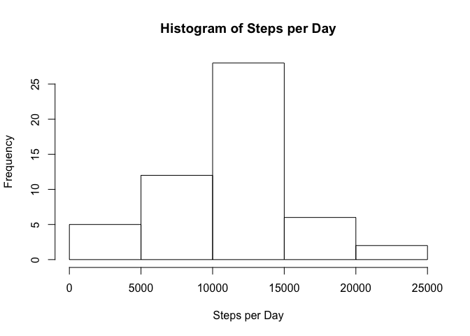
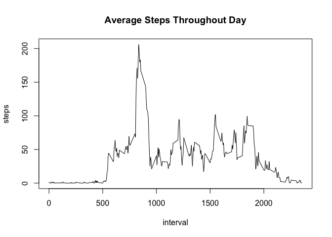
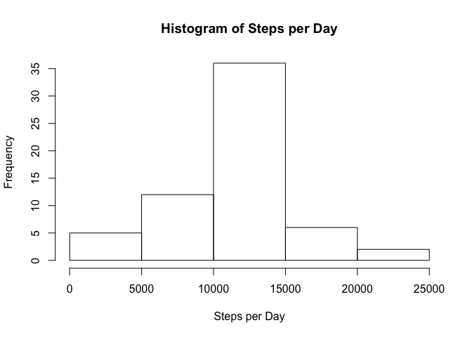
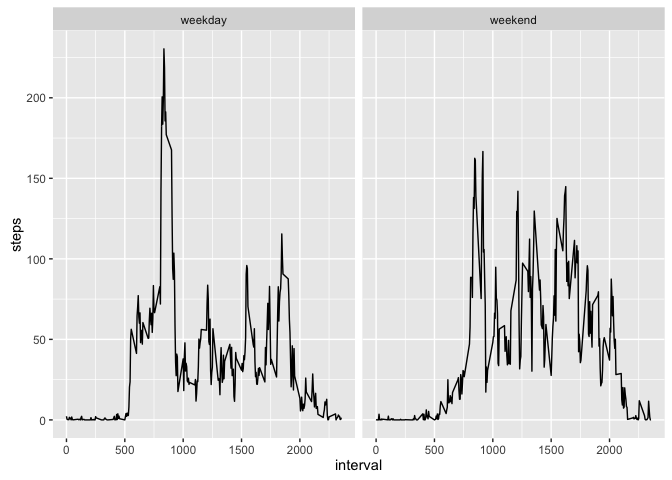

# Reproducible Research: Peer Assessment 1


## Loading and preprocessing the data
#### Set working directory to parent folder of "activity.zip"

```r
library(data.table)
unzip("activity.zip")
activity <- fread("activity.csv")
```

### Format the dates

```r
class(activity$date)
```

```
## [1] "character"
```

```r
activity$date <- as.POSIXct(strptime(activity$date, "%Y-%m-%d"))
class(activity$date)
```

```
## [1] "POSIXct" "POSIXt"
```

## What is mean total number of steps taken per day?  
### Split activity data by day, sum up steps for each split.  

```r
by_day <- aggregate(steps ~ date, data = activity, sum)
```

### Create histogram.

```r
hist(by_day$steps,
     xlab ="Steps per Day",
     main = "Histogram of Steps per Day")
```

<!-- -->

### Find mean and median.

```r
mean(by_day$steps)
```

```
## [1] 10766.19
```

```r
median(by_day$steps)
```

```
## [1] 10765
```

## What is the average daily activity pattern?
### Split activity data by interval, average steps for each split.

```r
by_int <- aggregate(steps ~ interval, data = activity, mean)
```

### Create plot.

```r
with(by_int, plot(interval, steps, type = "l",
                  main = "Average Steps Throughout Day"))
```

<!-- -->

### Find interval with max number of steps.

```r
by_int$interval[by_int$steps == max(by_int$steps)]
```

```
## [1] 835
```

## Imputing missing values
### Find number of missing values

```r
sum(is.na(activity))
```

```
## [1] 2304
```

### Replace NAs with average steps for that interval.

```r
library(plyr)
noNA <- ddply(activity,
              .(interval), 
              transform,
              steps = ifelse(is.na(steps), mean(steps, na.rm=TRUE), steps))
```

### Split activity data by day, sum up steps for each split.  

```r
by_day <- aggregate(steps ~ date, data = noNA, sum)
```

### Create histogram.

```r
hist(by_day$steps,
     xlab ="Steps per Day",
     main = "Histogram of Steps per Day")
```

<!-- -->

### Find mean and median.

```r
mean(by_day$steps)
```

```
## [1] 10766.19
```

```r
median(by_day$steps)
```

```
## [1] 10766.19
```

#### Do these values differ from the estimates from the first part of the assignment?
- The mean does not differ, but the median does.  

#### What is the impact of imputing missing data on the estimates of the total daily number of steps?
- Using averages to fill in missing data may pull the reported data to the middle and smooth out interesting trends on the margins.

## Are there differences in activity patterns between weekdays and weekends?
### Create weekday variable.

```r
noNA$weekday <- weekdays(noNA$date)

noNA$weekday[noNA$weekday == "Monday"] <- "weekday"
noNA$weekday[noNA$weekday == "Tuesday"] <- "weekday"
noNA$weekday[noNA$weekday == "Wednesday"] <- "weekday"
noNA$weekday[noNA$weekday == "Thursday"] <- "weekday"
noNA$weekday[noNA$weekday == "Friday"] <- "weekday"
noNA$weekday[noNA$weekday == "Saturday"] <- "weekend"
noNA$weekday[noNA$weekday == "Sunday"] <- "weekend"
```

### Split activity data by interval and weekday, average steps for each split.

```r
by_int <- aggregate(steps ~ interval + weekday, data = noNA, mean)
```

### Create plot.

```r
library(ggplot2)
```

```
## Warning: package 'ggplot2' was built under R version 3.2.4
```

```r
day_plot <- ggplot(data = by_int, aes(interval, steps)) + geom_line()
day_plot + facet_grid(. ~ weekday)
```

<!-- -->

